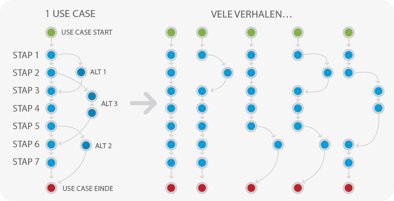

# 3. Documenteren
## 3.1 User stories
### 3.1.1 Wat zijn user stories?
- Een korte beschrijving van wat een gebruiker doet
- Enkele zinnen in de spreektaal van de gebruiker
- Wie wil wat en waarom?
- Moet op een post-it passen

### 3.1.2 Waarom user stories?
- Verbale communicatie stimuleren/forceren
- Snelle feedback
- Face-to-face communicatie
- Geen technisch jargon
- Planning faciliteren
- Detailleer waar en wanneer nodig

### 3.1.3 Een user story schrijven
Een goede user story is:
- Onafhankelijk (Independent)
- Onderhandelbaar (Negotiable)
- Waardevol voor de gebruiker en opdrachtgever (Valuable)
- Schatbaar (Estimatable)
- Klein (Small)
- Testbaar (Testable)

--> Focus op 6 elementen --> INVEST

### 3.1.4 Tips
- Identificeer de stories
- Slice the cake
  - Opsplitsen zodat alle lagen van de applicatie aandacht krijgen
- Gesloten stories, eindigen met een user goal
- Beperkingen vastleggen
- Focus op belangrijke zaken in de nabije toekomst
- GUI zolang mogelijk uitstellen
- Gebruik user roles in de story
- Schrijf voor 1 user
- Actieve taal gebruiken
- Laat gebruiker/opdrachtgever meeschrijven

## 3.2 Story map
1. Voorbereiding
2. Co-creatie
3. Verifiëer
4. Prioritiseer

- Voorkant post-it:
  - user story: Als een ... wil ik ... omdat ...
- Achterkant post-it:
  - acceptatie criteria: Als ... wanneer ... dan ...

### 3.2.1 Risico management
#### 3.2.1.1 Table stakes
Functionaliteit die er moet zijn om de markt te kunnen betreden.

#### 3.2.1.2 Enablers
High risk user stories vanuit een technisch standpunt.

#### 3.2.1.3 Exceptions en delighters
Functionaliteit die nodig is om te kunnen concurreren en om klanten te winnnen.

#### 3.2.1.4 Probe
Een progressieve feature zonder kritische kwaliteit.

## 3.3 Use case 2.0
**aka Use case slice**

- Hou informatie-uitwisseling simpel door het verhaal te vertellen.
- Begrijp en overie het grote geheel
- Focus op business value
- Bouw het systeem in use case slices
- Lever incrementeel op
- Flexibiliteit

1 use case kan veel verhalen hebben.

### 3.3.1 Stappenplan
1. Beschrijf de actoren en de use cases
2. Verdeel de use cases in use case slices
3. Voorbereiden van de use case slice
4. Analyseer de use case slice
5. Implementeer de software (voor de slice)
6. test de software (voor de slice)
7. Test het systeem in zijn geheel
8. Inspecteer en wijzig de use cases
