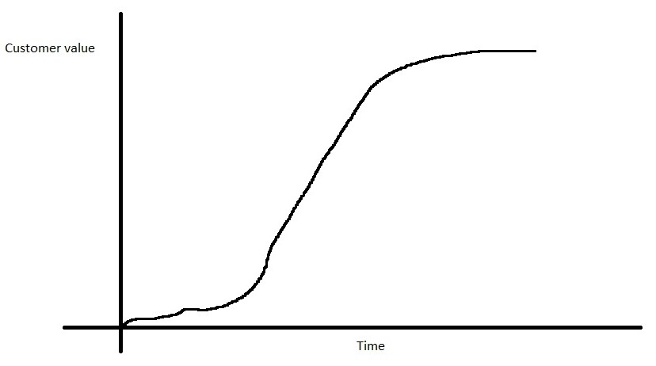
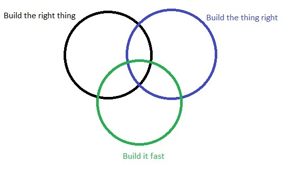

# Agile product ownership
## Begrippen
### Product owner
- visie voor een product
  - geen details
- weet wel waarom
  - weet wel welk probleem het oplost
  - weet wel voor wie het is

### Stakeholders
- gaan het product gebruiken
- gaan beïnvloed worden daar het systeem dat ontwikkeld word
- bedoeling dat deze van het product in ontwikkeling gaan houden

### User stories
- in deze documenten worden de noden van de gebruikers uitgelegd
- Zowel product owner als stakeholders hebben ideeën
  - PO zet deze ideeën om naar user stories

### Development team
- een zelf organiserend team
- zet de user stories om naar een programma
- gebruiken automatische testen en continious integration
- releasen 4-6 stories/week = capaciteit
  - stakeholders en PO limiteren hun ideeën niet tot 4-6/week
  - bij releases krijgen stakeholders nog meer ideeën
    - overflow
      - multitasking
      - demotivatie

## Voorkomen van overflow
1. De capaciteit van het development team is gekend.
2. De PO zoek uit welke stories belangrijkst zijn.

Wip limit: het maximaal aantal stories waaraan het team tegelijk kan werken.

Product backlog kan blijven groeien want gebruikers blijven ideeën krijgen.

## Beheer van de product backlog
- PO beheert de backlog
  - PO moet nee kunnen zeggen tegen features
  - PO bepaalt de volgorde
- Beheer gebeurt in samenspraak met de stakeholders en dev team
- Waarde en grootte helpen de PO om te prioritiseren
  - Waarde en grootte zijn niet gekend door PO
  - PO praat met stakeholders om de waarde te kunnen inschatten
  - PO praat met dev team om de grootte te kunnen inschatten
  - In het begin van het project zijn deze keuzes niet altijd accuraat
  - Bij iedere release leert men bij over waarde en grootte
  - Het inschatten van waarde en grootte is een continu proces
- Duidelijke stories vooraan in de product backlog, onduidelijke achteraan.
- Gebruik maken van 'Just in Time', zo gebruikt men de laatste informatie om te prioritiseren.

PO zorgt dat iedereen dezelfde visie deelt.

## Trade Offs
### Risico's
- Business risico:
  - Zijn we het juiste aan het maken?
- Sociaal risico:
  - Kan mijn team dit maken?
- Tactisch risico:
  - Gaat het werken?
  - Gaat het schalen?
- Kost en planningsrisico:
  - Gaat we het product op tijd klaar hebben?
  - Gaat de prijs ok zijn?

### Customer value - time curve

In het begin wordt er gefocust op kennis.
Hierbij gaat de curve niet steil naar boven.

Daarna gaat men focusen op customer value.
Hier gaat de curve steil omhoog.

Het laaste stuk van de curve duidt aan dat er niet meer veel waarde wordt toegevoegd en meestal wordt hier beslist om het project te stoppen.

### Korte termijn vs lange termijn
Er moet continu gebalanceerd worden tussen reactief werk en proactief werk.
(=balanceren tussen brandjes blussen en brand voorkomen)

### Building the right thing, building the thing right of building it fast

In de ideale wereld doen we alle drie deze dingen.

Als er enkel wordt gefocust op het maken van het juiste en dat juist te doen kan men de market window missen.

Als men het juiste snel bouwt, kunnen er veel bug inzitten waardoor het op de lange termijn onbruikbaar wordt.

Als men het juist en snel bouwt, dan loopt men het risico dat men het verkeerde aan het bouwen is.

- PO's waken erover dat het juiste product gebouwt wordt.
- Het dev team zorgt ervoor dat het juist gemaakt wordt.
- Scrum master zorgen ervoor dat het snel gemaakt wordt.

### Nieuw product of oud product verbeteren
Een team blijft gewoonlijk een oud product onderhouden terwijl ze een nieuw product aan het ontwikkelen zijn.
De product backlog wordt op deze manier meer een team backlog bij afgewerkte projecten.

## Groot project met meerdere teams
Alles blijft ongeveer hetzelfde als bij het vorige.
De PO's moeten nu ook tegen elkaar praten.
Ook moet men het aantal afhankelijkheden reduceren.
Hiervoor maakt men vaak gebruik van een chief PO
