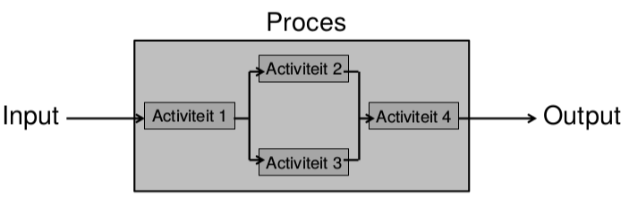
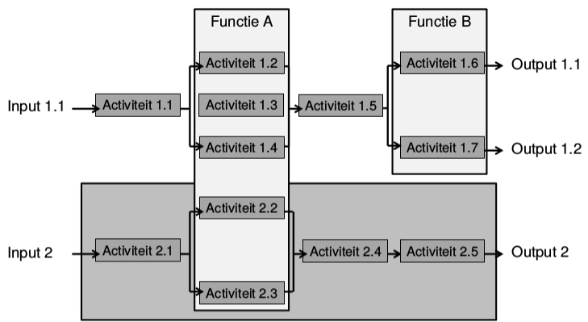

# 4. Processen
## 4.1 Inleiding
### 4.1.1 Business Process Management
- Gericht op een bedrijfsorganisatie
- Meestal voortraject van IT-project

### 4.1.2 Business Analyse
- Vertrekt van resultaat BPM-oefening
- Gericht op IT-project
- Tijdens business analyse blijkt vaak nood aan procesoptimalisatie

## 4.2 Wat is een proces?
- Transformatie van input naar output
- Creëren van waarde voor afnemer of klant
- Realiseren van doelen

__Opmerkingen:__
- Input van een proces is vaak de output van andere processen.
- Processen in een organisatie worden in het algemeen gepland en uitgevoerd onder beheerste onstandigheden.

## 4.3 Business Process Management
> The first rule of any technology used in a business is that automation applied to an efficient operation will magnify the efficiency.
> The second is that automation applied to an inefficient operation will magnify the inefficiency.
>
> *Bill Gates*

IT vergemakkelijkt de procesverandering en creëert zo business waarde.

### 4.3.1 Continuous Process Improvement (CPI)
- Stelt huidige processtructuur niet in vraag.
- Identificeert problemen en lost ze 1 voor 1 op.

### 4.3.2 Business Process Re-Engineering (BRP)
- Stelt de fundamentele veronderstellingen en principes van de huide processtructuur in vraag.
- Gericht op het realiseren van een doorbraak.

## 4.4 Verklaring van enkele begrippen
- Input: Iets dat getransformeerd, verbruikt, verwerkt wordt.
- Output: Iets dat geproduceerd wordt.
- Besturing: Hoe en wanneer een proces/activiteit plaatsvindt.
- Middelen: Personen, systemen, tools, uitrusting, activa...

## 4.5 End-to-End
- Een proces begint bij de behoefte van externe klant of afnemer.
  - Klant of afnemer triggert het proces
- Proces eindigt bij dezelfde klant of afnemer.
  - Trigger is volledig beantwoord.
  - Eén of meerdere outputs
  -
### 4.5.1 Verschil tussen proces en functie
- Proces:
  - Verzameling activiteiten
  - Gericht op het bereiken van één of meerdere outputs
- Functie:
  - Verzameling van activiteiten
  - Gegroepeerd volgens competentie

Hierbij zijn de afdelingen niet noodzakelijk afhankelijk van het proces of de functie.

### 4.5.2 Belang van processen
Processen zijn het hart van een organisatie.

- Processen lopen vaak verkeerd bij transfer.
- 2 belangrijke dimensies in organisatie
  - Strategische dimensie: de juiste dingen doen
    - Effeciviteit
    - Verbeteren van het vermogen om waarde te creëren.
  - Operationele dimensie: de dingen goed doen
    - Efficiëntie
- Creëren van waarde gebeurt via de processen.
- Niet alle processen zijn gericht op waarde creëren
  - Niet alle processen zijn evenwaardig
  - Vaak stappen zonder toegevoegde waarde
  - Identificeer deze:
    - Primaire, ondersteunende, sturende processen binnen de organisatie?
    - Factoren die significante bijdrage leveren tot het creëren van waarde.
    - Essentiële processen?
    - Performantie van de essentiële processen?
- Waarde creërende processen
  - Meestal primaire processen
  - Gelinkt aan de kerncompetentie
  - Kritisch belang
- Andere processen kunnen ook bijdragen tot strategische doelstellingen.

### 4.5.3 Procesmodel
- Ordenen van sleutel processen
- Visuele voorstelling op het meest globale niveau van de organisatie.
- 3 clusters van processen:
  - Primaire, ondersteunende en sturende processen

#### 4.5.3.1 Sturende processen
aka management processen

- Richting geven en doelen stellen
- Evaluatie en controle
- gedrag van de organisatie

#### 4.5.3.2 Primaire processen
aka core business processen

- Productontwikkeling
- Productie
- Dagelijkse operaties
- Sales en marketing

#### 4.5.3.3 Ondersteunende processen
aka support business processen

- ICT (bij ICT bedrijf is dit core)
- Boekhouding (bij boekhoudkantoor is dit core)
- Human resources

### 4.5.4 Problemen bij processen
- Functioneel georganiseerde organisaties
  - Functie/afdeling = verticaal
  - Proces = horizontaal
- Dalende doeltreffendheid door groei
  - Groei leidt tot specialisatie
    - Efficiënter worden op bepaald domein, maar eindoel uit het oog verliezen.
- Gewoontevorming
  - Men stelt niet meer in vraag wat men doet en hoe men het doel

### 4.5.5 Verschillende organisatie types
#### 4.5.5.1 Verticaal functionele kachelpijpen
- Elke kachelpijp stel een specifieke functie of dienst uit.
- Komt voor in hiërarchische, gecentraliseerde organisaties.
- Expertise wordt gedeeld over gans het bedrijf
- Duidelijke carrièrepaden en opleidingsprogramma's.
- Voor elke functie bestaan er backups
- Managers zijn vertrouwd met werk van ondergeschikten.
- Standaarden kunnen makkelijk gehanteerd worden.
- *Nadelen:*
  - Een eenheid op zich
  - Focus op individuele dienstverlening
  - Gericht op efficiëntie en niet op effectiviteit
  - Communicatieproblemen
  - Business prioriteiten kunnen afwijken van de functionele prioriteiten
  - Opgeleverde projecten voldoen niet aan de noden van de business units

#### 4.5.5.2 Horizontale proces-tunnels
- Komt voor in gedecentraliseerde organisaties
- Units worden gecreëerd om te focussen op een bepaald business domein
- Prioriteiten zijn gebaseerd op de noodzaak van producten en processen.
- De communicatie tussen de diensten is veel beter
- Personeel is op de hoogte van diverse aspecten van de producten en processen.
- *Nadelen:*
  - Perceptie: opwaartse carrièrepaden beperkt
  - Jobevaluaties gebeuren vaak door leidinggevenden die de job zelf niet kennen.
  - Vaak weinig backup personeel
  - Weinig synergie in het gedrag

## 4.6 Starten met procesverbetering
Kritische of sleutelprocessen:
- Staan in functie van de strategie van een organisatie.
- Dragen bij tot het voldoen aan de behoeften van de belanghebbenden.
- Zijn de sleutel tot het succes of coninuïteit van de organisatie.
- Worden bepaald op basis van de kritische succesfactoren.

Een SWOT analyse is een mogelijk vertrekpunt.
