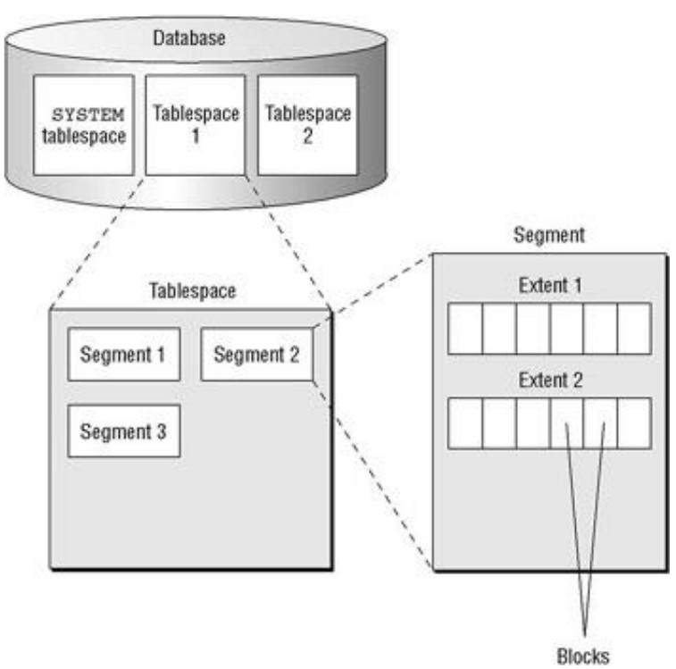
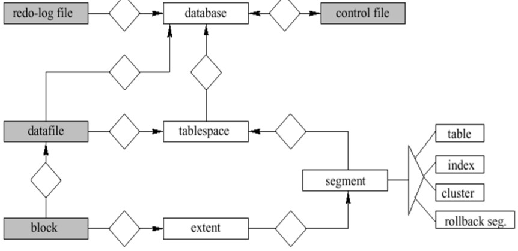

# 1 Oracle architecture
## 1.1 Basics
- Oracle instance
  - Logische eenheid
  - Server waaraan de vragen gesteld worden.

- Oracle database
  - Fysieke eenheid
  - Hier staat de data effectief

Om de database te initialiseren stopt men parameters in de spfiles.

## 1.2 Files of a database
### 1.2.1 Control files
- Zonder control files kan de database niet starten.
  - Naam van de database, charset ... zijn hierin opgeslagen.

- Houdt de locaties bij van andere fysieke files
- Zeker zorgen voor kopies van deze files (minstens 2).
- RAID is niet voldoende voor de kopie van de config files:
  - Als iemand per ongelijk de config file verknoeid is de kopie ook stuk.

### 1.2.2 Data files
- Data dictionary
  - Degene die bijhoudt wie welke rechten op een tabel heeft.

- **Datablock** is de kleinste eenheid waarin men data gaat lezen en/of schrijven naar de database.
- Aaneengesloten datablocks = **extend**
- Aaneengesloten extends = **segment**
- Segmenten worden ondergebracht in **tablespaces**

Tablespace is het grootste onderdeel waarin een database kan opgesplitst worden.

 

### 1.2.3 Redo log files
Redo log files nemen alle veranderingen op die het gevolg zijn van transacties.

### 1.2.4 Fysieke vs Logische structuur

 

## 1.2 Oracle instance

 

### 1.2.1 Verloop
### 1.2.2 Componenten
#### 1.2.2.1 Database buffer
