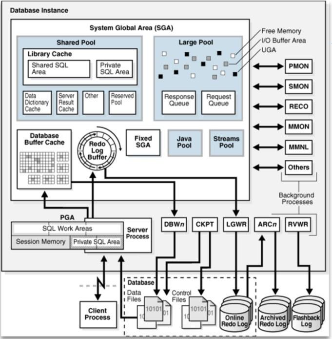

# 1 Oracle architecture
## 1.1 Basics
- Oracle instance
  - Logische eenheid
  - Server waaraan de vragen gesteld worden.

- Oracle database
  - Fysieke eenheid
  - Hier staat de data effectief

Om de database te initialiseren stopt men parameters in de spfiles.

## 1.2 Files of a database
### 1.2.1 Control files
- Zonder control files kan de database niet starten.
  - Naam van de database, charset ... zijn hierin opgeslagen.

- Houdt de locaties bij van andere fysieke files
- Zeker zorgen voor kopies van deze files (minstens 2).
- RAID is niet voldoende voor de kopie van de config files:
  - Als iemand per ongelijk de config file verknoeid is de kopie ook stuk.

### 1.2.2 Data files
- Data dictionary
  - Degene die bijhoudt wie welke rechten op een tabel heeft.

- **Datablock** is de kleinste eenheid waarin men data gaat lezen en/of schrijven naar de database.
- Aaneengesloten datablocks = **extend**
- Aaneengesloten extends = **segment**
- Segmenten worden ondergebracht in **tablespaces**

Tablespace is het grootste onderdeel waarin een database kan opgesplitst worden.

 

### 1.2.3 Redo log files
Redo log files nemen alle veranderingen op die het gevolg zijn van transacties.

### 1.2.4 Fysieke vs Logische structuur

 

## 1.2 Oracle instance
### 1.2.1 Verloop
### 1.2.2 Componenten
#### 1.2.2.1 Database buffer
- Bevat een gedeelte van de data zoals die in de datafiles staat.
- Gemeenschappelijk voor alle clients
- Server proces haalt de data uit de datafiles en stopt ze in de database buffer cache
  - Dedicated server proces: 1 server proces voor 1 client
  - Shared server proces: verzameling van server processen die staan te wachten tot een client iets vraagt

- 3 types buffers:
  1. Dirty buffer: data die gewijzigd is
  2. Free buffer: buffer die niet in gebruik is
  3. pinned buffer: buffer die momenteel gelezen wordt

- 2 lijsten:
  1. dirty buffers
  2. last recently used list:
    - meest recent gelezen vooraan, minst recent achteraan

#### 1.2.2.2 Redo log buffer
- Wordt veel vaker weggeschreven dan de database buffer
  - kleiner dan database buffer cache

- Vergelijkbaar met casette recorder
- Met zo weinig mogelijk data de acties opslaan
  - delete en rij opslaan
  - update, rij en waarde opslaan
  - insert en complete rij opslaan

- Wordt weggeschreven naar de redo log files

_Redo log files:_
- Verschillende redo log files in een redo log groep (allemaal kopies van elkaar)
- Als een groep vol is in de volgende groep beginnen schrijven.
- Als je opnieuw begint te schrijven in een groep waarin er al eerder geschreven is dan schrijf je eerst die groep weg naar de archived redo log files

#### 1.2.2.3 Library cache
SQL statement
- Parse tree:     kijken of de structuur klopt
- Execution plan: kijken of het uitgevoerd word

Kijken of iemand hetzelfde vraag stelt, zo hoeft de instance niet alles opnieuw maken

#### 1.2.2.4 Data dictionary cache
- Om sneller aan de datadictonary te kunnen zodat we het niet constant uit de datafiles moeten halen
- Kijken of de gebruiker de benodigde rechten heeft

#### 1.2.2.5 Database writer
- Dirty buffers wegschrijven naar de datafiles
- Minstens 1x om de 3 seconden

#### 1.2.2.6 Log writer
Wanneer:
- Bij commit
- Als 1/3e vol
- Database writer schrijft naar datafiles
- Om de 3 seconden

#### 1.2.2.7 System monitor
- Opkuisdienst
- Datablock opnemen tot extends
- Bij opstarten kijken of er geen problemen waren bij het uitschakelen en fouten herstellen.

#### 1.2.2.8 Proces monitor
Kijkt of er geen processen die stilgevallen zijn en die ergens een lock op hebben.

#### 1.2.2.9 Checkpoint
Update headers van de control files

### 1.2.3 Visuele weergave

 

